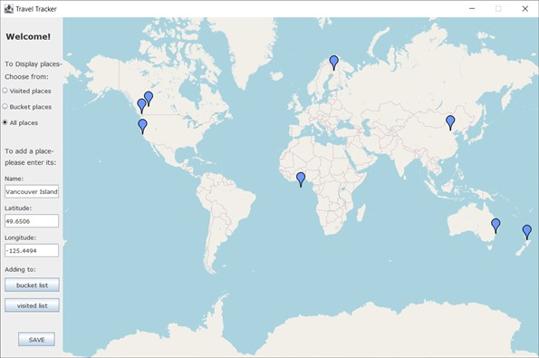

**My Personal Project**

This is the updated version of my first Java Gui project.   

In this version, I use PlaceOfInterest with
- a field of String to represent its name
- a field of GeoPoint to represent its location
- a field of State to represent if the user has been to the location or have not

Adding a State as a field of my object is the design choice different from the previous version.   
In the previous version, two separate lists, *bucketList & visitedList*, were used to collect travel destinations.  
In this version, user can type in the name and coordinates of any places you want to visit or have already visited in the past.   
This app will automatically update the map image and track all the information provided by the user!

The design is meant to be robust - it can handle non-meaningful keyboard console entries.   
The design applied the observer pattern to reduce coupling. 

The picture below is a screenshot of project GUI on January 09, 2022.    
  
  

